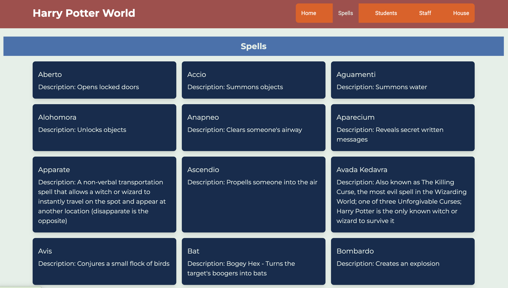

# Harry Potter Info App in React using TailwindCSS

A web application that provides detailed information about the Harry Potter universe. It uses the Harry Potter API to fetch real-time data about characters, spells, and houses. You can find more information about the API [here](https://hp-api.herokuapp.com/).

## Features

* List of all characters, with the ability to search for a specific character.
* Detailed information about spells used in the Harry Potter series.
* Information about the four Hogwarts houses.

## Project Screenshots

### Character List


### Spells List


### Houses List


## Technologies used

* React - For UI development
* Tailwind CSS - For CSS component styling

## Running the Project

To run the project locally, follow these steps:

1. **Clone the repository**:
  ```sh
  git clone https://github.com/apfirebolt/react_harry_potter.git
  cd react_harry_potter
  ```

2. **Install dependencies**:
  ```sh
  npm install
  ```

3. **Start the development server**:
  ```sh
  npm run dev
  ```

4. **Open your browser** and navigate to `http://localhost:3000` to see the application running.

For a production build, you can run:
```sh
npm run build
```
This will create an optimized build of the application in the `dist` folder.

## How to Contribute

1. Fork the repository.
2. Create a new branch (`git checkout -b feature-branch`).
3. Make your changes.
4. Commit your changes (`git commit -m 'Add some feature'`).
5. Push to the branch (`git push origin feature-branch`).
6. Open a pull request.

Thank you for your contributions!
