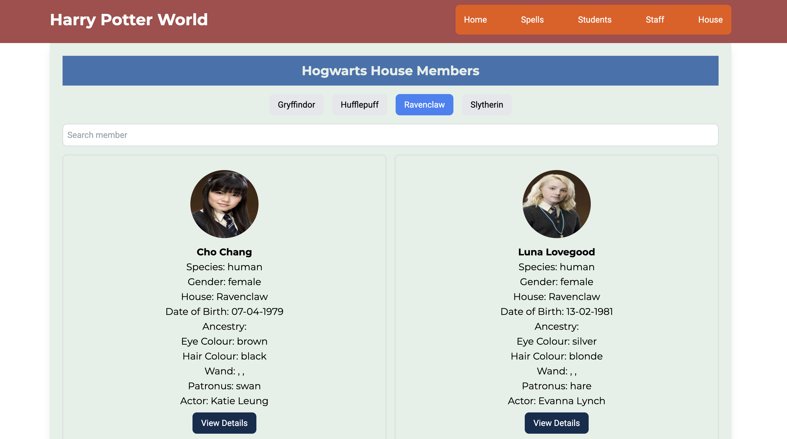
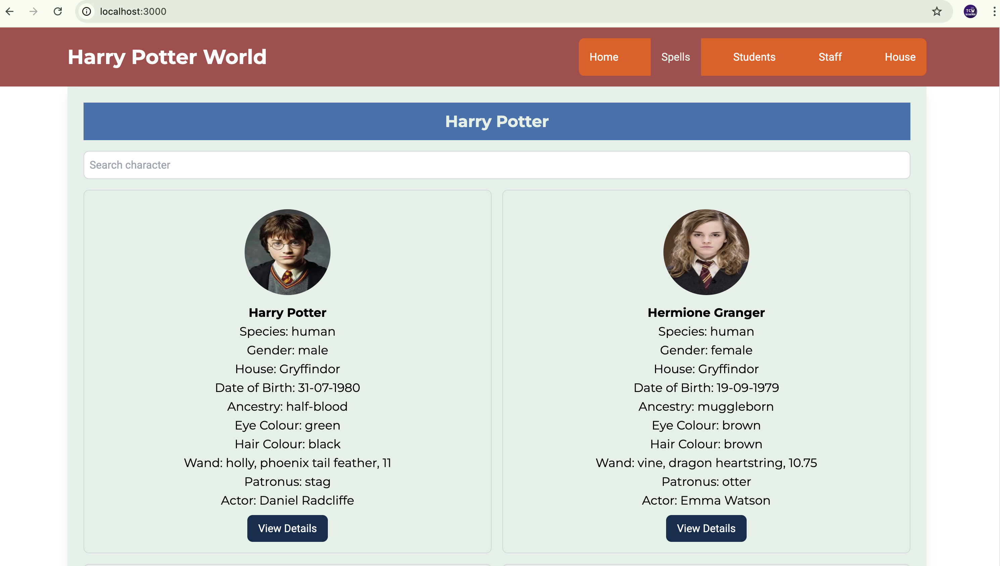

# Cryptocurrency Info App in React using TailwindCSS

A web application which uses the CoinGecko API to fetch real-time cryptocurrency data. You can find more information about the API [here](https://www.coingecko.com/en/api). The API provides a generous free tier for testing and experimenting with the data.

## Features

* List of all popular crypto coins, ability to search for a given coin.
* List of trending crypto coins from the API.
* List of exchanges for trading crypto coins.

## Technologies used

* React - For UI development
* Tailwind CSS - For CSS component styling

# Adding Shadcn

```

```

Create tsconfig.json file with the following contents 

```
{
  "compilerOptions": {
    // ...
    "baseUrl": ".",
    "paths": {
      "@/*": ["./src/*"]
    }
    // ...
  }
}
```

Install Types package and update vite.config.js file

```
npm install -D @types/node
```

```
import { defineConfig } from 'vite'
import react from '@vitejs/plugin-react'
import path from 'path'
import { fileURLToPath } from 'url'

const __filename = fileURLToPath(import.meta.url)
const __dirname = path.dirname(__filename)

// https://vite.dev/config/
export default defineConfig({
  plugins: [react()],
  server: {
    port: 3000,
  },
  resolve: {
    alias: {
      "@": path.resolve(__dirname, "./src"),
    },
  },
})
```

Run the CLI

```
npx shadcn@latest init
```

Configure components.json file

```
Which style would you like to use? › New York
Which color would you like to use as base color? › Zinc
Do you want to use CSS variables for colors? › no / yes
```

That's it, you can now start adding components to your project. For adding button, use the following command

```
npx shadcn@latest add button
```

To use it anywhere inside your application

```
import { Button } from "@/components/ui/button"
 
export default function Home() {
  return (
    <div>
      <Button>Click me</Button>
    </div>
  )
}
```

## Available Scripts

In the project directory, you can run:

### `npm start`

Runs the app in the development mode.\
Open [http://localhost:3000](http://localhost:3000) to view it in your browser.

The page will reload when you make changes.\
You may also see any lint errors in the console.

### `npm test`

Launches the test runner in the interactive watch mode.\
See the section about [running tests](https://facebook.github.io/create-react-app/docs/running-tests) for more information.

### `npm run build`

Builds the app for production to the `build` folder.\
It correctly bundles React in production mode and optimizes the build for the best performance.

The build is minified and the filenames include the hashes.\
Your app is ready to be deployed!

See the section about [deployment](https://facebook.github.io/create-react-app/docs/deployment) for more information.

### `npm run eject`

**Note: this is a one-way operation. Once you `eject`, you can't go back!**

If you aren't satisfied with the build tool and configuration choices, you can `eject` at any time. This command will remove the single build dependency from your project.

Instead, it will copy all the configuration files and the transitive dependencies (webpack, Babel, ESLint, etc) right into your project so you have full control over them. All of the commands except `eject` will still work, but they will point to the copied scripts so you can tweak them. At this point you're on your own.

You don't have to ever use `eject`. The curated feature set is suitable for small and middle deployments, and you shouldn't feel obligated to use this feature. However we understand that this tool wouldn't be useful if you couldn't customize it when you are ready for it.

## Project Screenshots

### Home Page


On the homepage you have option to search for coins and can see price of the coins in USD and INR through a modal.

### Coin List


### Trending Coins


### Exchanges List


## Contribute

I welcome contributions to this project! If you have suggestions for improvements or have found a bug, please open an issue or submit a pull request. Here are some ways you can contribute:

1. **Report Bugs**: If you find a bug, please report it by opening an issue. Be sure to include details about the bug and how to reproduce it.

2. **Suggest Features**: If you have an idea for a new feature, please open an issue to discuss it. We welcome all ideas and feedback.

3. **Submit Pull Requests**: If you have a fix or a new feature that you would like to contribute, please submit a pull request. Make sure to follow the project's coding standards and include tests for your changes.

4. **Improve Documentation**: If you find any part of the documentation unclear or incomplete, feel free to make improvements.

### How to Contribute

1. Fork the repository.
2. Create a new branch (`git checkout -b feature-branch`).
3. Make your changes.
4. Commit your changes (`git commit -m 'Add some feature'`).
5. Push to the branch (`git push origin feature-branch`).
6. Open a pull request.

Thank you for your contributions!
